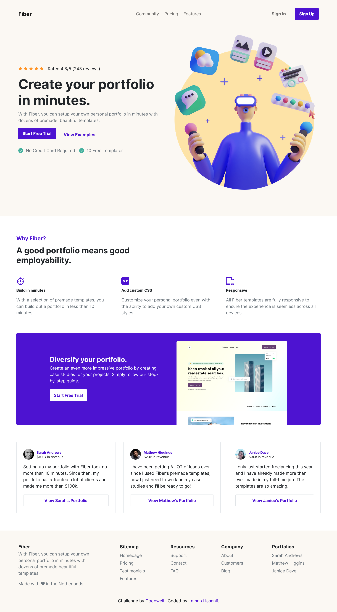
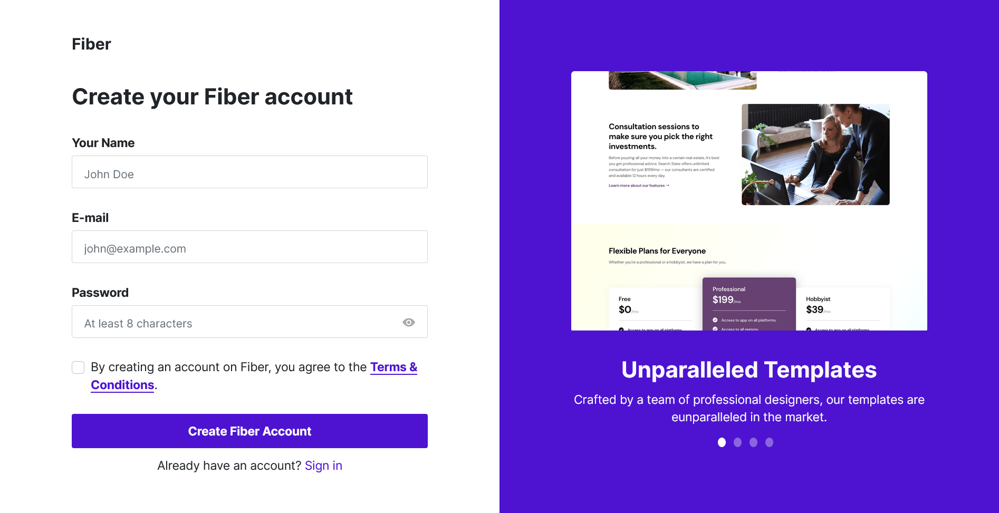

# Codewell - Fiber Landing Page solution

This is a solution to the [Fiber Landing Page challenge on Codewell](https://www.codewell.cc/challenges/fiber-landing-page--608a7e639691700015db16d1).

## Table of contents

- [Overview](#overview)
  - [The challenge](#the-challenge)
  - [Screenshot](#screenshots)
  - [Links](#links)
- [My process](#my-process)
  - [Built with](#built-with)
- [Author](#author)

## Overview

### The challenge

Users should be able to:

- View the optimal layout for the site depending on their device's screen size
- See hover states for all interactive elements on the page
- Go to Sign up page when Sign up button is clicked

### Screenshots

### Links

- Solution URL: [https://github.com/HasanliLaman/fiber](https://github.com/HasanliLaman/fiber)
- Live Site URL: [https://hasanlilaman.github.io/fiber/](https://hasanlilaman.github.io/fiber/)

## My process

### Built with

- Semantic HTML5 markup
- CSS custom properties
- Flexbox
- Mobile-first workflow
- Bootstrap
- Javascript

## Author

- Github - [Laman Hasanli](https://github.com/HasanliLaman)
- Frontend Mentor - [@HasanliLaman](https://www.frontendmentor.io/profile/HasanliLaman)
